# Deteccao de Fraude com PaySim no Azure Databricks

Projeto de engenharia de dados e machine learning para deteccao de fraude usando o dataset PaySim em uma arquitetura lakehouse no Azure Databricks.

O pipeline organiza os dados em camadas Bronze, Silver e Gold, cria features de comportamento transacional e compara modelos de classificacao com MLflow.

## Principais resultados

- Dataset com `6,362,620` transacoes e `8,213` fraudes.
- Fraudes concentradas em `TRANSFER` e `CASH_OUT`.
- Como a fraude e rara, a analise prioriza `PR-AUC`, `recall_fraud`, `precision_fraud`, `f1_fraud` e impacto financeiro simulado, nao apenas acuracia.
- As features elevaram o PR-AUC da Decision Tree de `0.5345` para `0.9963`.
- Random Forest detectou `490` fraudes a mais apos feature engineering.
- Nos modelos baseados em arvore, as fraudes perdidas cairam de mais de `500` casos para apenas `9`.
- Modelos com features chegaram a aproximadamente `99.94%` do valor fraudulento detectado.
- No Random Forest, o valor financeiro simulado nao detectado caiu de `R$ 117.47M` para `R$ 1.43M`.
- As camadas foram gravadas no ADLS Gen2 em conteineres `bronze`, `silver` e `gold`, usando Delta Lake sobre Parquet.

## Azure Data Lake

O projeto grava as camadas no Azure Data Lake Storage Gen2 usando tres conteineres:

- `bronze`
- `silver`
- `gold`

No Databricks, os caminhos sao montados com o protocolo `abfss`, sempre usando placeholders no repositorio:

```python
f"abfss://bronze@{STORAGE_ACCOUNT}.dfs.core.windows.net/fraud/paysim/source_files/"
f"abfss://bronze@{STORAGE_ACCOUNT}.dfs.core.windows.net/fraud/paysim/tables/raw_transactions/"
f"abfss://silver@{STORAGE_ACCOUNT}.dfs.core.windows.net/fraud/paysim/tables/transactions_clean/"
f"abfss://gold@{STORAGE_ACCOUNT}.dfs.core.windows.net/fraud/paysim/tables/fraud_kpis/"
```

As tabelas principais sao salvas em formato Delta. O Delta Lake usa arquivos Parquet por baixo e adiciona log transacional, versionamento e confiabilidade para leitura e escrita no lakehouse.

## Objetivo

Detectar transacoes fraudulentas e medir o impacto das features engenheiradas em duas frentes:

- Metricas de modelo, como PR-AUC, recall, precision e F1.
- Metricas financeiras, como valor de fraude detectado e valor de fraude que deixou de ser perdido.

## Estrutura do projeto

```text
azure-databricks-fraud-detection-paysim/
|-- README.md
|-- .gitignore
|-- LICENSE
|-- requirements.txt
|-- Data/
|   |-- README.md
|   |-- bronze/
|   |   |-- README.md
|   |   |-- raw_transactions_schema.csv
|   |   `-- bronze_raw_transactions_sample_20.csv
|   |-- silver/
|   |   |-- README.md
|   |   |-- transactions_clean_schema.csv
|   |   `-- silver_transactions_clean_sample_20.csv
|   `-- gold/
|       |-- README.md
|       |-- fraud_kpis.csv
|       |-- fraud_kpis_schema.csv
|       |-- fraud_by_type.csv
|       |-- fraud_by_type_schema.csv
|       |-- model_financial_comparison_csv.csv
|       `-- model_financial_comparison_schema.csv
|-- docs/
|   |-- architecture.md
|   |-- business_understanding.md
|   |-- data_pipeline.md
|   |-- feature_engineering.md
|   |-- how_to_run.md
|   |-- model_results.md
|   `-- security.md
|-- images/
|   |-- azure_containers.png
|   |-- architecture.png
|   |-- comparison_financial_detection_rate_3stage.png
|   |-- comparison_financial_gain.png
|   |-- comparison_financial_loss_rate_3stage.png
|   |-- comparison_frauds_detected_missed.png
|   |-- comparison_pr_auc.png
|   |-- comparison_recall_fraud.png
|   |-- databricks_mlflow_runs.png
|   |-- random_forest_3stage_financial_story.png
|   `-- random_forest_summary.png
|-- Notebooks/
|   |-- 01_bronze_ingestion.py
|   |-- 02_silver_feature_engineering.py
|   |-- 03_gold_ml_dataset.py
|   `-- 04_train_fraud_model_mlflow.py
|-- Reports/
|   |-- model_business_metrics_csv.csv
|   |-- model_before_after_comparison_csv.csv
|   |-- model_financial_comparison_csv.csv
|   `-- model_report_summary_csv.csv
`-- src/
    |-- __init__.py
    `-- config.py
```

## Camadas de dados

### Bronze

Camada bruta com as transacoes originais do PaySim. Ela preserva as colunas de entrada, como tipo da transacao, valor, saldos antes/depois, flag de fraude real e flag de fraude marcada pelo simulador.

O notebook `01_bronze_ingestion.py` baixa o CSV do PaySim, copia o arquivo bruto para o conteiner `bronze` e depois grava a tabela Delta `raw_transactions`.

### Silver

Camada limpa e enriquecida. Ela padroniza tipos, remove duplicatas exatas e cria features como:

- Erros de saldo da origem e do destino.
- Versoes absolutas dos erros de saldo.
- `amount_log`.
- Flags de saldo zerado.
- Flags para `TRANSFER`, `CASH_OUT` e tipos associados a fraude.
- `data_source` para rastreabilidade.

O notebook `02_silver_feature_engineering.py` le a tabela Delta da Bronze, aplica as transformacoes e grava `transactions_clean` no conteiner `silver`.

### Gold

Camada analitica e de consumo. Inclui KPIs gerais, estatisticas por tipo de transacao, datasets de machine learning no Databricks e comparacoes de resultado dos modelos.

O notebook `03_gold_ml_dataset.py` le a Silver e grava tabelas Gold no conteiner `gold`, incluindo KPIs, agregacoes por tipo e datasets de machine learning. O notebook `04_train_fraud_model_mlflow.py` tambem exporta relatorios e comparacoes financeiras para a camada Gold.

## Resultado geral dos modelos

O projeto comparou dois cenarios:

1. **Baseline**: modelos treinados com variaveis originais e flags simples.
2. **Engineered features**: modelos treinados com novas features criadas na camada Silver.

Como o problema e altamente desbalanceado, a metrica mais importante nao e a acuracia. Acuracia pode ficar alta mesmo quando o modelo quase nao detecta fraude. Por isso, a analise priorizou PR-AUC, recall da fraude, precision da fraude, F1 da fraude e impacto financeiro simulado.

Precision-Recall e especialmente util quando a classe positiva e rara, como em deteccao de fraude.

### Comparacao tecnica: baseline vs features

| Modelo | PR-AUC baseline | PR-AUC com features | Recall fraude baseline | Recall fraude com features | Fraudes detectadas a mais |
| --- | ---: | ---: | ---: | ---: | ---: |
| Logistic Regression | 0.0265 | 0.1859 | 0.24% | 2.57% | +38 |
| Decision Tree | 0.5345 | 0.9963 | 69.57% | 99.45% | +471 |
| Random Forest | 0.7901 | 0.9947 | 68.42% | 99.45% | +490 |
| GBT | 0.7930 | 0.9947 | 69.14% | 99.45% | +478 |

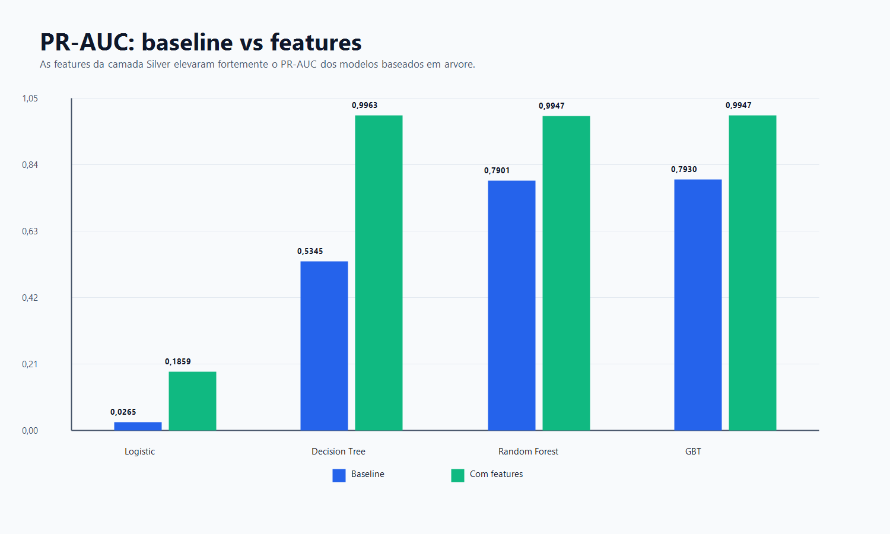

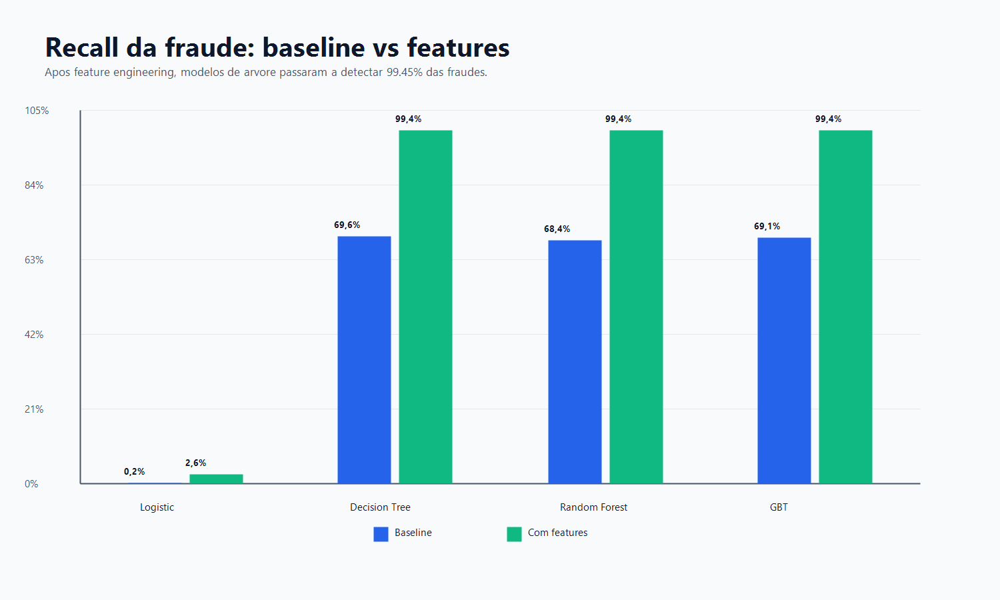

A leitura principal e que as features criadas na Silver melhoraram drasticamente os modelos baseados em arvore. O melhor baseline ja tinha bom desempenho, principalmente Random Forest e GBT, com PR-AUC proximo de `0.79`. Apos incluir features como erro de saldo, saldo zerado, `amount_log` e tipo de transacao de risco, os modelos passaram para PR-AUC proximo de `0.995` a `0.996`.

### Fraudes detectadas e perdidas

| Modelo | Fraudes detectadas baseline | Fraudes perdidas baseline | Fraudes detectadas com features | Fraudes perdidas com features |
| --- | ---: | ---: | ---: | ---: |
| Logistic Regression | 4 | 1,652 | 42 | 1,590 |
| Decision Tree | 1,152 | 504 | 1,623 | 9 |
| Random Forest | 1,133 | 523 | 1,623 | 9 |
| GBT | 1,145 | 511 | 1,623 | 9 |

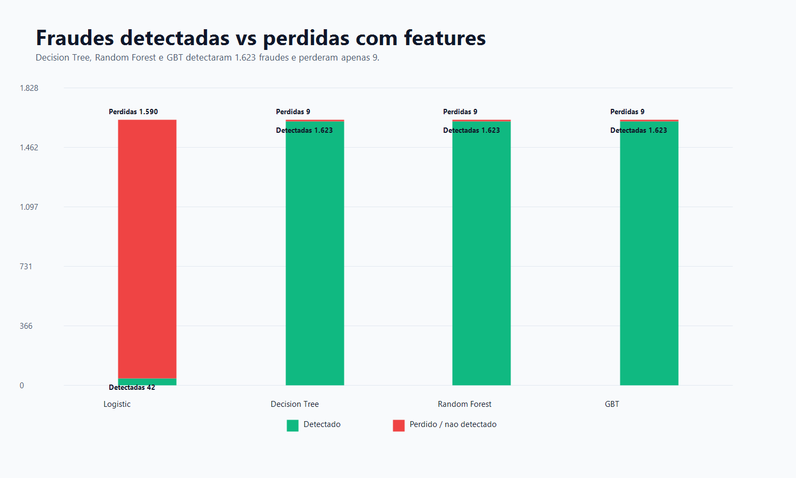

Antes da engenharia de features, os melhores modelos deixavam passar mais de `500` fraudes no conjunto de teste. Depois da engenharia de features, Decision Tree, Random Forest e GBT deixaram passar apenas `9` fraudes.

Nos modelos com features baseados em arvore:

- `precision_fraud = 1.0000`
- `recall_fraud = 0.9945`
- `f1_fraud = 0.9972`

Ou seja, no threshold usado, eles detectaram quase todas as fraudes e nao marcaram transacoes normais como fraude no conjunto de teste.

## Resultado financeiro simulado

O PaySim e um dataset sintetico de transacoes financeiras gerado por simulador. Por isso, os valores abaixo devem ser lidos como **impacto financeiro simulado**, nao dinheiro real.

A leitura financeira principal deve comparar tres estagios:

1. **Sem modelo**: todo o valor fraudulento passa sem bloqueio ou alerta.
2. **Baseline**: o modelo ja reduz grande parte da perda, mas ainda deixa passar dezenas ou centenas de milhoes nos modelos fortes.
3. **Com features**: os modelos baseados em arvore reduzem o valor perdido para aproximadamente `R$ 1.43M`.

| Modelo | Valor detectado baseline | Valor perdido baseline | Valor detectado com features | Valor perdido com features | Ganho detectado |
| --- | ---: | ---: | ---: | ---: | ---: |
| Logistic Regression | R$ 19.29M | R$ 2.33B | R$ 376.81M | R$ 1.93B | +R$ 357.52M |
| Decision Tree | R$ 2.23B | R$ 110.66M | R$ 2.30B | R$ 1.43M | +R$ 66.40M |
| Random Forest | R$ 2.23B | R$ 117.47M | R$ 2.30B | R$ 1.43M | +R$ 73.21M |
| GBT | R$ 2.23B | R$ 110.93M | R$ 2.30B | R$ 1.43M | +R$ 66.67M |

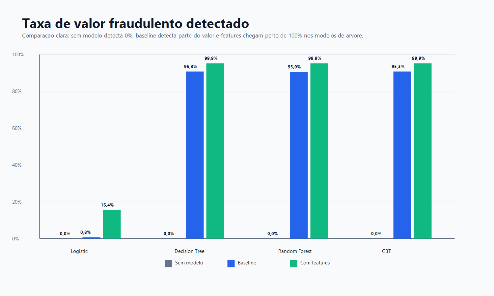

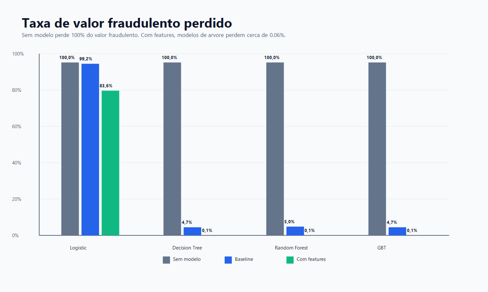

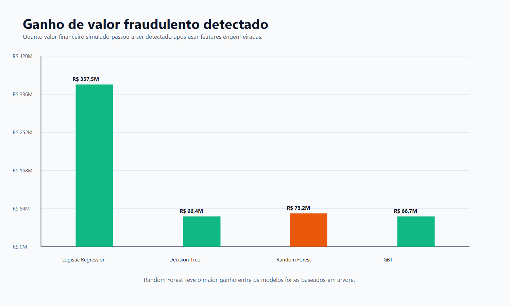

A melhor leitura de negocio: com as features engenheiradas, os modelos baseados em arvore reduziram o valor fraudulento nao detectado de aproximadamente `R$ 110M` a `R$ 117M` para cerca de `R$ 1.43M`.

Os graficos financeiros priorizados no README usam taxas e uma narrativa em tres estagios porque graficos empilhados com bilhoes e milhoes no mesmo eixo podem esconder a diferenca real entre baseline e features.

O Random Forest teve o maior ganho financeiro absoluto entre os modelos fortes:

- `+R$ 73.21M` em valor fraudulento detectado.
- `-R$ 116.05M` em valor fraudulento nao detectado.
- Taxa de valor detectado subiu de `94.99%` para `99.94%`.

## Modelo recomendado

O modelo principal recomendado para apresentacao e o **Random Forest com features**.

Mesmo que a Decision Tree tenha o maior PR-AUC por uma diferenca minima, o Random Forest e mais defensavel tecnicamente por ser um ensemble de arvores, geralmente mais robusto que uma unica arvore. Alem disso, ele teve o maior ganho financeiro detectado entre os modelos baseados em arvore.

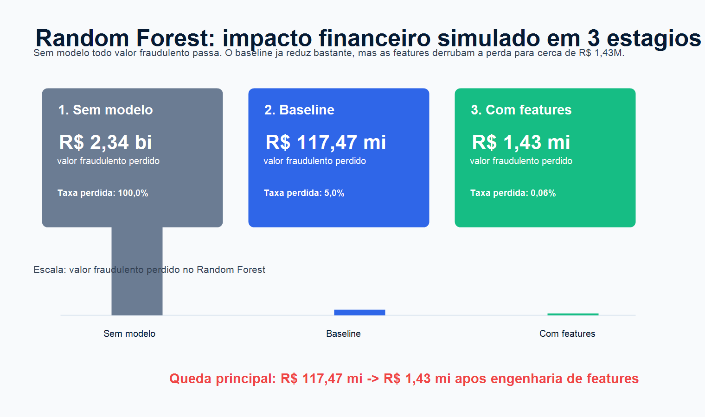

Resumo do Random Forest com features:

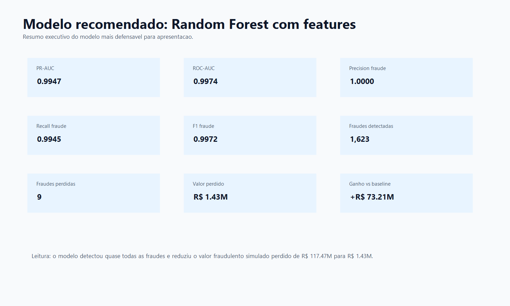

| Metrica | Valor |
| --- | ---: |
| PR-AUC | 0.9947 |
| ROC-AUC | 0.9974 |
| Precision fraude | 1.0000 |
| Recall fraude | 0.9945 |
| F1 fraude | 0.9972 |
| Fraudes detectadas | 1,623 |
| Fraudes perdidas | 9 |
| Valor fraudulento detectado | R$ 2.30B |
| Valor fraudulento perdido | R$ 1.43M |
| Ganho financeiro vs baseline | +R$ 73.21M |

## Texto executivo

A engenharia de features foi o principal fator de melhoria do projeto. No baseline, os melhores modelos detectavam cerca de `68%` a `70%` das fraudes, deixando mais de `500` casos fraudulentos passarem no conjunto de teste. Apos a criacao de features comportamentais, como inconsistencia de saldo, saldo zerado, transformacao logaritmica do valor e flags de tipos transacionais de risco, os modelos baseados em arvore passaram a detectar `99.45%` das fraudes.

No Random Forest, o PR-AUC subiu de `0.7901` para `0.9947`, e o valor financeiro simulado nao detectado caiu de `R$ 117.47M` para apenas `R$ 1.43M`. O resultado mostra que a engenharia de features teve impacto direto tanto na performance tecnica quanto na reducao de perda financeira simulada.

## Documentacao

- `docs/architecture.md`: arquitetura do pipeline e fluxo das camadas.
- `docs/business_understanding.md`: contexto de negocio, metricas e impacto de falsos positivos/negativos.
- `docs/data_pipeline.md`: explicacao passo a passo dos notebooks e saidas no Azure.
- `docs/feature_engineering.md`: explicacao das features criadas na Silver.
- `docs/how_to_run.md`: guia de execucao no Azure Databricks, incluindo Storage Account, Unity Catalog, External Locations e MLflow.
- `docs/model_results.md`: comparacao dos modelos e impacto financeiro.
- `docs/security.md`: praticas para manter o repositorio sem credenciais.

## Arquitetura visual

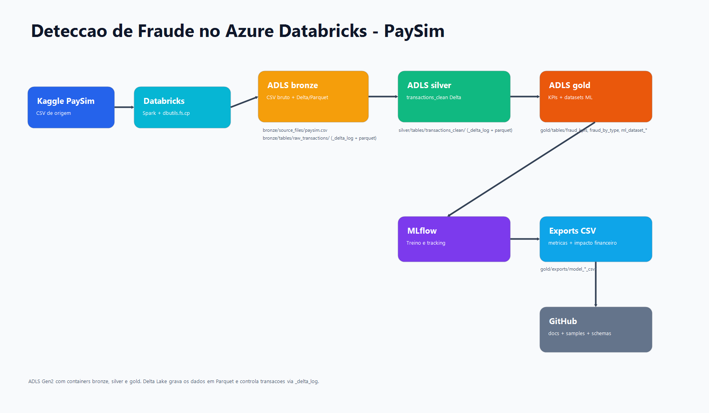

## Evidencias visuais

### Containers no Azure Data Lake

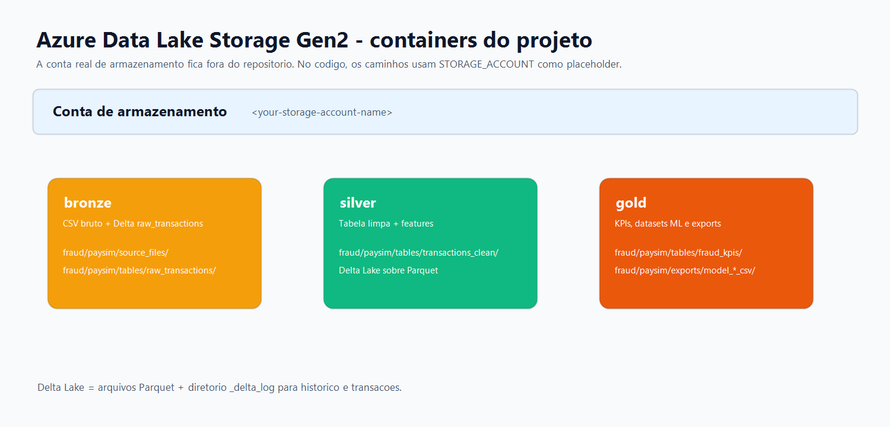

### Execucoes do MLflow no Databricks

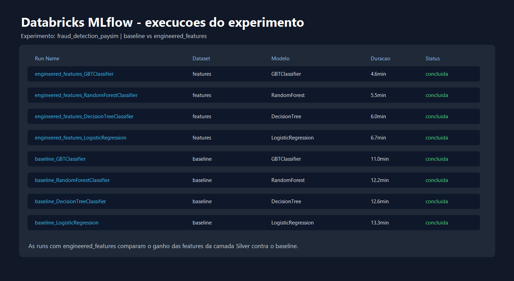

## Seguranca

Este repositorio nao deve conter contas reais de armazenamento, emails pessoais, chaves, tokens, segredos, strings de conexao ou arquivos como `kaggle.json`.

As configuracoes publicas ficam em `src/config.py` com placeholders. Credenciais devem ser carregadas no Databricks por segredos, por exemplo:

```python
dbutils.secrets.get(scope="kaggle", key="username")
dbutils.secrets.get(scope="kaggle", key="key")
```

## Execucao

Execute os scripts na ordem:

1. `Notebooks/01_bronze_ingestion.py`
2. `Notebooks/02_silver_feature_engineering.py`
3. `Notebooks/03_gold_ml_dataset.py`
4. `Notebooks/04_train_fraud_model_mlflow.py`

Antes de executar no Databricks, ajuste os placeholders de `src/config.py` no seu ambiente.
