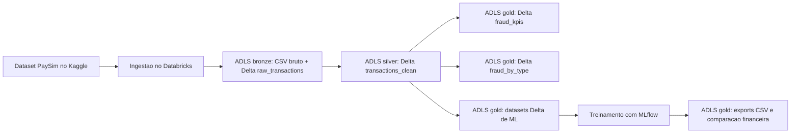
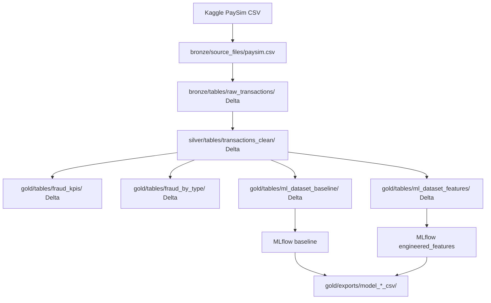

# Arquitetura

Este projeto usa um pipeline no estilo lakehouse no Azure Databricks para transformar dados transacionais do PaySim em datasets prontos para machine learning e relatorios de negocio.

## Fluxo



## Fluxo tecnico



## Azure Data Lake Storage

O armazenamento do projeto fica no Azure Data Lake Storage Gen2, separado em tres conteineres:

| Conteiner | Papel | Exemplos |
| --- | --- | --- |
| `bronze` | Entrada bruta e tabela Bronze | CSV original e `raw_transactions` |
| `silver` | Tabela limpa e enriquecida | `transactions_clean` |
| `gold` | Tabelas analiticas, datasets de ML e exports | `fraud_kpis`, `fraud_by_type`, `ml_dataset_*`, relatorios CSV |

Os caminhos seguem o padrao:

```text
abfss://<container>@<storage-account>.dfs.core.windows.net/fraud/paysim/...
```

O nome real da storage account nao deve ser commitado. No codigo, ele vem de `STORAGE_ACCOUNT` em `src/config.py`.


## Delta, Parquet e CSV

As tabelas Bronze, Silver e Gold sao gravadas em Delta Lake. O Delta Lake armazena os dados fisicamente em arquivos Parquet e adiciona o diretorio `_delta_log`, que controla historico, transacoes e confiabilidade.

O projeto tambem exporta alguns resultados finais como CSV, principalmente para relatorios, documentacao e leitura rapida no GitHub.

## Evidencia do MLflow

O experimento `fraud_detection_paysim` registra runs para os modelos baseline e para os modelos com features engenheiradas.


## Camadas

### Bronze

A camada Bronze armazena as transacoes brutas do PaySim apos a ingestao. Ela mantem a estrutura original da fonte para permitir rastreabilidade e validacoes posteriores.

No Azure, a Bronze usa o conteiner `bronze`:

```text
fraud/paysim/source_files/paysim.csv
fraud/paysim/tables/raw_transactions/
```

Tabela principal:

- `raw_transactions`

Documentacao:

- `Data/bronze/README.md`
- `Data/bronze/raw_transactions_schema.csv`
- `Data/bronze/bronze_raw_transactions_sample_20.csv`

### Silver

A camada Silver padroniza tipos de dados, remove duplicatas exatas e adiciona features orientadas a deteccao de fraude.

No Azure, a Silver usa o conteiner `silver`:

```text
fraud/paysim/tables/transactions_clean/
```

Tabela principal:

- `transactions_clean`

Principais transformacoes:

- Padronizacao de colunas numericas e categoricas.
- Criacao de features de erro de saldo.
- Criacao de flags de saldo zerado.
- Criacao de flags para tipos de transacao com risco.
- Criacao de `amount_log`.
- Inclusao de `data_source` para rastreabilidade.

Documentacao:

- `Data/silver/README.md`
- `Data/silver/transactions_clean_schema.csv`
- `Data/silver/silver_transactions_clean_sample_20.csv`

### Gold

A camada Gold contem saidas analiticas, datasets de machine learning e comparacoes finais dos modelos.

No Azure, a Gold usa o conteiner `gold`:

```text
fraud/paysim/tables/fraud_kpis/
fraud/paysim/tables/fraud_by_type/
fraud/paysim/tables/ml_dataset_baseline/
fraud/paysim/tables/ml_dataset_features/
fraud/paysim/exports/
```

Principais saidas:

- `fraud_kpis`
- `fraud_by_type`
- `ml_dataset_baseline`
- `ml_dataset_features`
- `model_financial_comparison_csv`

Documentacao:

- `Data/gold/README.md`
- `Data/gold/fraud_kpis_schema.csv`
- `Data/gold/fraud_by_type_schema.csv`
- `Data/gold/model_financial_comparison_schema.csv`

## Ordem de execucao

Os notebooks foram exportados como arquivos `.py` e devem ser executados nesta ordem:

1. `Notebooks/01_bronze_ingestion.py`
2. `Notebooks/02_silver_feature_engineering.py`
3. `Notebooks/03_gold_ml_dataset.py`
4. `Notebooks/04_train_fraud_model_mlflow.py`

## Seguranca

O repositorio usa placeholders em `src/config.py`. Nomes reais de storage account, credenciais e tokens devem ser configurados somente no ambiente de execucao, preferencialmente por Databricks Secrets.
